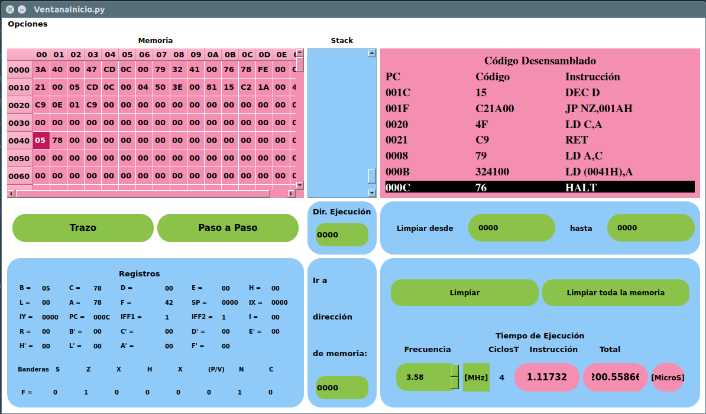

# PySim ZEighty

### Este proyecto emula el funcionamiento del procesador Z80

- [x] Desensamblado
- [x] Funciones del Z80
- [x] Emulador de la memoria
- [x] GUI
- [x] Obtener 10

### Ventana de Inicio

### Simulador

